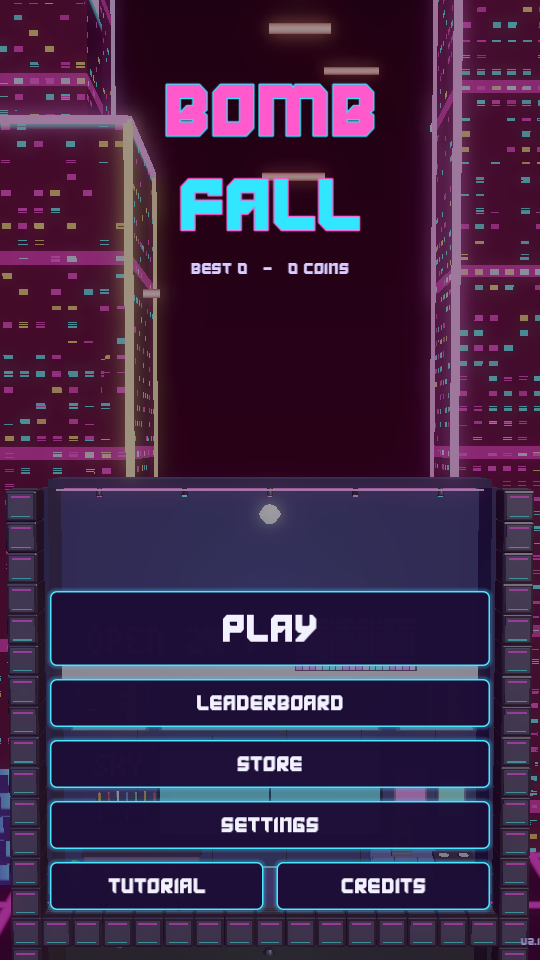
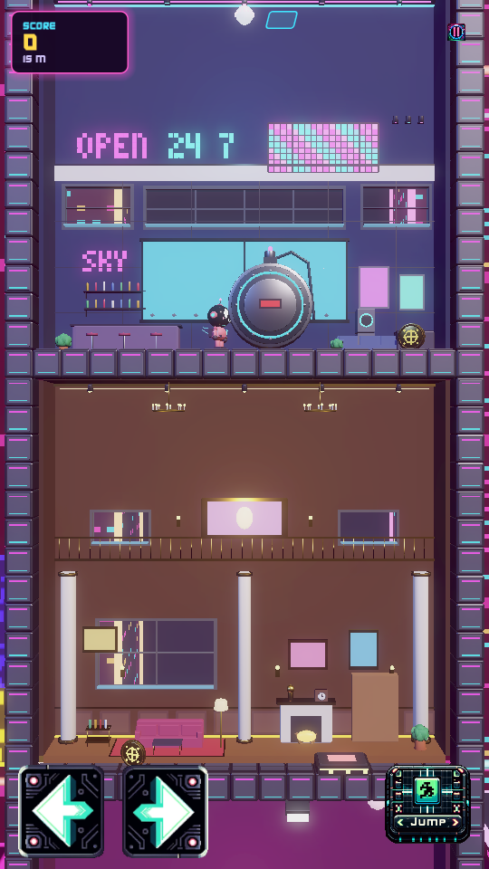
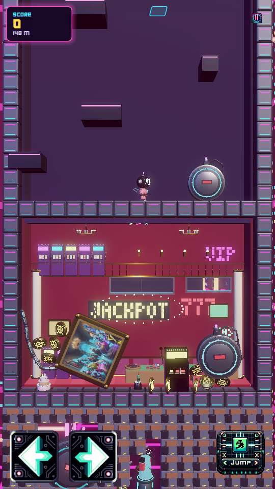
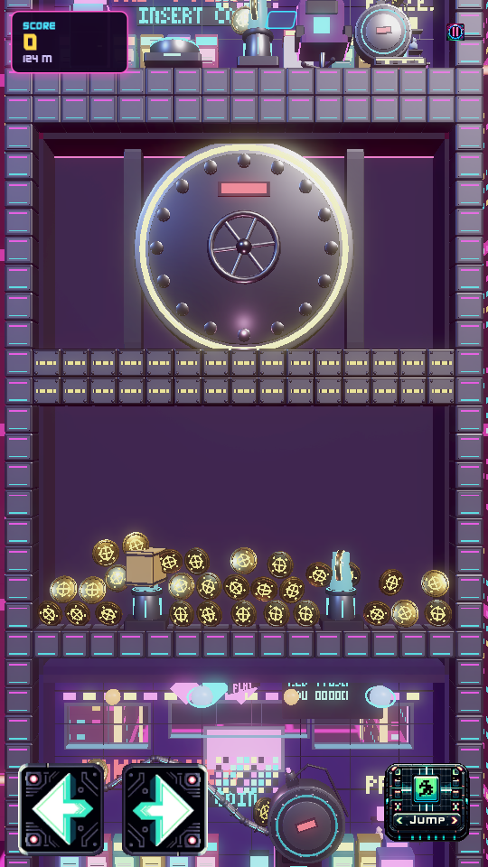
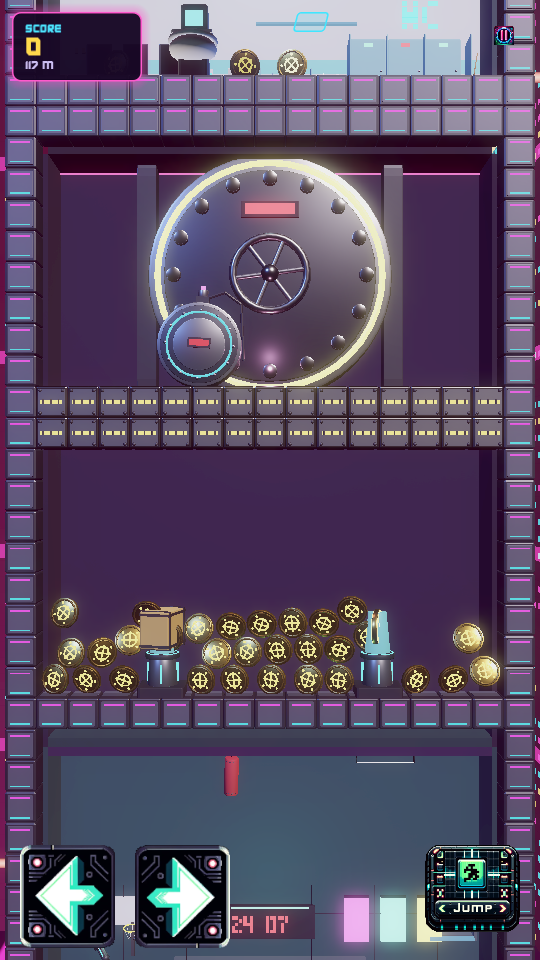
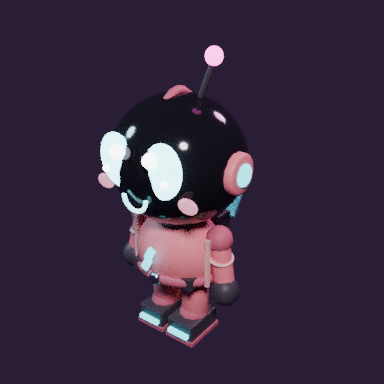

# BombFall

Fall through a neon hotel. Bombs rain from above: their blasts punch holes
through the floors you stand on, so ride them down, dodge the drones, wall
guns and lasers, push the furniture around, and grab coins and shields on
the way. The deeper you get, the faster it comes.

This is the 3D remake of the original 2D BombFall (Godot 3 + Rust). Same
game, same tuning, rebuilt on **Godot 4.7** with every asset modelled in
**Blender** from scripts, a procedurally lit cyberpunk city behind the
hotel's windows, and a single-language GDScript code base.

| | | |
|---|---|---|
|  |  |  |
|  |  |  |

## Play it

* **Android:** [`dist/BombFall.apk`](dist/BombFall.apk) (arm64, signed with a
  throwaway key, so it installs as a fresh app next to the store version).
  The GitHub Actions workflow rebuilds it on every push and attaches the APK
  as an artifact.
* **Desktop:** open the folder in Godot 4.7 and press play, or
  `godot --path .`. Keys: `A`/`D` or arrows to move, `Space`/`W`/`Up` to
  jump, `Esc` to pause. Mouse clicks act as touches on the on-screen buttons.

## Layout

| Path | What |
|---|---|
| `project.godot` | Godot 4.7 project: mobile renderer, Jolt physics, portrait 1080x1920. |
| `src/autoload/` | Singletons: `SaveData` (profile JSON, same keys as the original save), `Music` (playlist that survives scene changes), `Services` (ads/backend interfaces), `Game` (scene routing). |
| `src/actors/` | Player, bomb, explosion, coin and the `PlanarBody` base that pins rigid bodies to the XY plane. |
| `src/world/` | The generator: `World` (storey ring buffer, bomb rain, garbage collection), `Level` (layout on a `BinaryGrid`), `SpawnRegistry` (every prop with footprint, difficulty and the room themes), `CellGrid` (destructible floors/walls as PhysicsServer bodies + one MultiMesh per cell kind), `Backdrop` (themed rooms with window openings), `City` (the parallax skyline). |
| `src/spawnables/` | Hazards and furniture: drone, wall gun, light ring laser, trampoline, treadmill, pressure button, fire zone, ropes, bumper, air fan, slot machine, arcade cabinet, pick-ups (shields, magnet, crate, coin doubler), pushable props. |
| `src/special_levels/` | The junk wall, the obstacle course, the bat boss arena and the bank vault, inserted every ten storeys. |
| `src/game/`, `src/main/`, `src/ui/` | Run scene, tutorial, camera rig, main menu with live preview, store, settings, leaderboard, credits, HUD. |
| `src/dev/` | Headless smoke test, the physics regression harness, a sandbox and a harness that forces a special level or theme (excluded from exports). |
| `blender/` | One Python script per model plus `common.py` (primitives, neon materials, glTF export, preview render), `props.py` (set dressing kit) and `furniture.py` / `hazards.py` (prop builders). `blender/previews/` holds a render of each model. |
| `assets/models/` | The exported `.glb` files, committed so the game builds without Blender. |
| `assets/shaders/` | Facade, beacon, car-light, billboard, searchlight, moon, sun, grid, mountain, haze and sky shaders of the city. |
| `tools/` | `build_models.sh` (rebuild all models), `build_apk.sh` (headless Android export), `gen_prop_scenes.py`. |

## Rebuilding the models

```sh
tools/build_models.sh              # every model -> assets/models/*.glb
tools/build_models.sh bomb player  # just these
PREVIEW=1 tools/build_models.sh    # also render blender/previews/*.png
```

Needs Blender 4.0+ on the PATH (`BLENDER=/path/to/blender` to override).
Each script runs with `blender -b --python blender/<name>.py`, builds the
model from primitives with named pivots the game animates (`leg_l`,
`rotor_1`, `wing_r`, `gun`, `top`...), joins the static parts into one mesh
and exports glTF with the Y-up conversion. One unit is one metre, which is
one hotel cell (the 2D game used 64 px cells).

## Building the APK

```sh
tools/build_apk.sh            # release -> dist/BombFall.apk
tools/build_apk.sh debug      # debug build
```

Requirements: the Godot 4.7.2 editor binary on the PATH (or `GODOT=...`),
its export templates installed, JDK 17, and an Android SDK path set in the
editor settings (`export/android/android_sdk_path`). Only `platform-tools/adb`
and `build-tools/<v>/apksigner` are used because the export does not use a
Gradle build. To sign with your own key, set
`GODOT_ANDROID_KEYSTORE_RELEASE_PATH`, `_USER` and `_PASSWORD` before running
the script; the CI workflow reads them from repository secrets.

The package name is `ch.senges.bombfall`; change `package/unique_name` in
`export_presets.cfg` if the store listing uses another one.

## Headless checks

```sh
godot --headless --path . --import
godot --headless --path . res://src/dev/smoke_test.tscn     # 40 s scripted run
godot --headless --path . res://src/dev/physics_test.tscn   # 19 physics scenarios, prints PASS/FAIL
godot --path . res://src/dev/special_test.tscn -- --special=vault
godot --path . res://src/dev/special_test.tscn -- --theme=casino
godot --path . -- --theme=gym --screenshot=shot.png:2       # any scene, saves a frame
```

The physics harness spawns the player, bombs, ropes, props and hazards in
isolation and asserts on positions after a fixed number of physics ticks
(landing, wall clamps, bomb holes, rope length, trampoline height, prop
pushing without tipping, drone hover, button presses, laser kills...). Run
it after touching anything under `src/actors/` or `src/spawnables/`.

## Version 2.1

* **Physics pass.** Props no longer get launched or tipped by the player:
  pushing is capped at a walking speed that scales with stick input, every
  furniture body has a low centre of mass and angular damping, and bombs
  damage steel cells once per blast. The regression harness above pins the
  behaviour down.
* **UI refurbish.** New neon theme with glowing panels, a HUD with a
  popping score, depth meter, shield bar and doubler badge, toasts for
  pick-ups, a death screen with depth and previous best, fades between
  scenes, and a title screen with your stats and a skyline view.
* **Backgrounds.** Two new room themes (arcade, casino) with windows on the
  city, animated ceilings in every theme (fans, disco balls, swinging
  lamps, lanterns and punching bags), and a busier skyline: airship, moon,
  searchlights, sky bridges and more billboard traffic.
* **Character.** The runner is a rounder chibi with a bigger helmet, a
  scarf, eyes that blink, an antenna that springs, jet boots that flare
  while airborne, landing squash and a somersault on long falls.
* **New content.** Steel cells that take three blasts, bumpers that kick
  you away, air fans that lift you, slot machines that pay out coins (or a
  bomb) when hit, arcade cabinets, a coin doubler pick-up, and the bank
  vault special level: crack the steel floor to reach the treasure.

## What changed from the original

* **Godot 3.5 to 4.7.** New scene format, `CharacterBody3D`/`RigidBody3D`
  with Jolt, typed GDScript, `max_polyphony` instead of four audio players,
  autoloads instead of hand-carrying the music player between scenes.
* **Rust/GDNative dropped.** GDNative does not exist in Godot 4 and the
  level generator was tile-map specific anyway; it is now `src/world/`, in
  GDScript, about the same size and easier to tweak. Nothing else in the
  game touched Rust.
* **2D to 3D.** Gameplay still happens on a plane (bodies are axis-locked),
  so every number from the original survives: bomb timers, blast radius,
  jump height, spawn tables and shield item odds. Floors and walls are
  destructible cells rendered with a MultiMesh; rooms are real boxes two
  metres deep with set dressing and windows onto a city that parallaxes as
  you fall.
* **Ads and Firebase are stubbed** (`src/autoload/services.gd`). Neither
  SDK can be bundled in a headless build (both need Google's Maven at build
  time). The interfaces are small: plug real implementations in and the
  store, leaderboard and revive flow use them. Until then reviving costs
  coins instead of an ad, the leaderboard is local, and the username is
  stored on the device.
* **Save files are compatible.** `user://save_game.json` keeps the same keys,
  so coins, upgrades and scores carry over.

Music by Karl Casey @ White Bat Audio. Font: KARIXBY.
